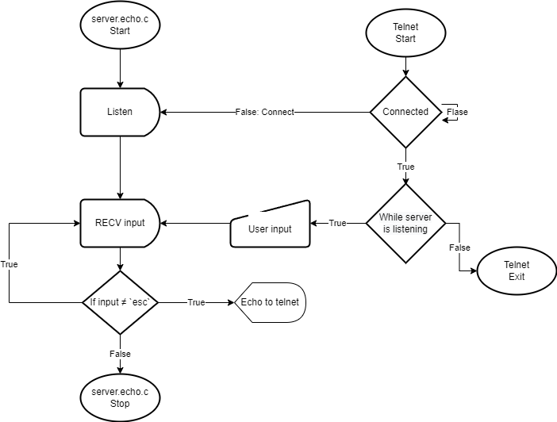

# **Relazione tecnica - Socket Client**

> ## **Indice**
>1) [**Definizione del problema**](#1-definizione-del-problema)
>2) [**Architettura**](#2-architettura)
>3) [**Criticità da discutere**](#3-criticità-da-discutere)
>4) [**Codice**](#4-codice)
>5) [**Testing**](#5-testing)
>6) [**Conclusioni**](#6-conclusioni)

## *1) Definizione del problema*
Lo scopo di questa esercitazione è quello di creare un client echo utilizzando i socket, bisogna quindi potersi connettersi al server tramite il client, e inviare dei caratteri per poi riceverli di nuovo come ricevuta conferma.

## *2) Architettura*

## *3) Criticità da discutere*

### *3.1) Criticità: Codice sviante*
___
Il codice in certi punti è stato sviante, quindi voleva fare cose fondalmene sbagliate, come ad esempio utilizzare 2 socket, uno del client e uno del server, invece di utilizzare esclusivamente il socket del client.

Un'altro caso è stato un fake FIXME alla conversione da stringa a intero tramite un atoi

Definita una variabile SOCKET_PORT, che non è corretta siccome la porta la si inserisce al momento dell'esecuzione del programma.
